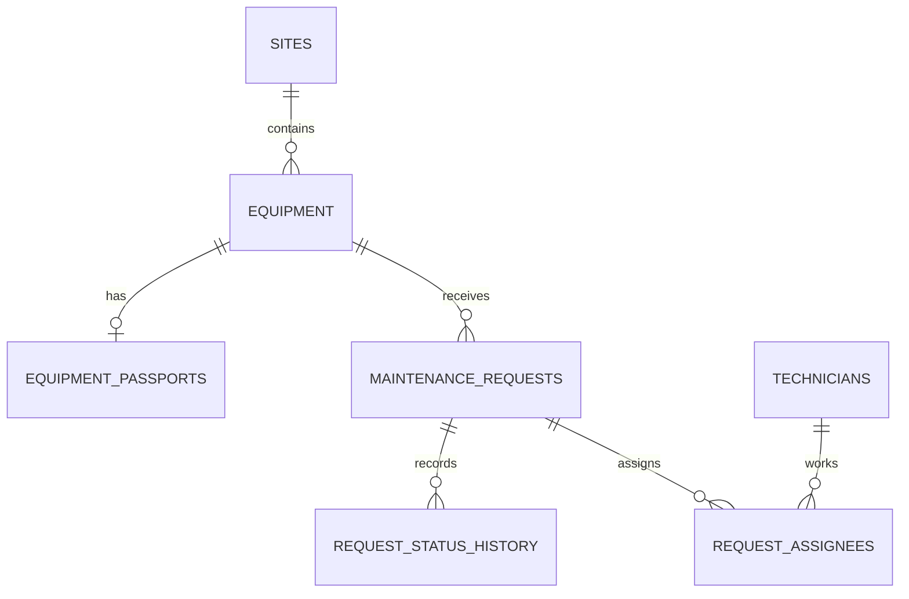

# Case 4: Maintenance API

REST API на Express + PostgreSQL (Sequelize) для учёта заявок на
техническое обслуживание оборудования производственных площадок.

Сервис ведёт справочники площадок, оборудования, специалистов,
контролирует жизненный цикл заявки (переходы статусов с историей),
назначает бригады на заявки и предоставляет аналитические отчёты
на SQL.

## Содержание

- [Требования](#требования)
- [Установка и запуск](#установка-и-запуск)
- [Переменные окружения](#переменные-окружения)
- [Структура проекта](#структура-проекта)
- [Архитектура](#архитектура)
- [Архитектурные решения и ограничения](#архитектурные-решения-и-ограничения)
- [Эндпоинты](#эндпоинты)
- [Мониторинг и эксплуатация](#мониторинг-и-эксплуатация)
- [Параметры списочных эндпоинтов](#параметры-списочных-эндпоинтов)
- [Модель данных](#модель-данных)
- [Переходы статусов](#переходы-статусов)
- [Формат ответа и ошибок](#формат-ответа-и-ошибок)
- [Коды ответов](#коды-ответов)
- [Примеры запросов и ответов](#примеры-запросов-и-ответов)
- [Прогноз погоды](#прогноз-погоды)
- [Безопасность](#безопасность)
- [Логирование](#логирование)
- [Тестирование](#тестирование)
- [Postman](#postman)
- [Демонстрация отката транзакции](#демонстрация-отката-транзакции)
- [Транзакции](#транзакции)
- [Правила удаления](#правила-удаления)
- [Схема БД](#схема-базы-данных)
- [Миграции и сиды](#миграции-и-сиды)
- [Откат миграций](#откат-миграций)

## Требования

- Node.js >= 18 (используется нативный `fetch` для внешнего API)
- Docker Desktop с Docker Compose
- npm

## Установка и запуск


```bash
# 1. Установить зависимости
npm install

# 2. Скопировать пример окружения (PowerShell)
Copy-Item .env.example .env

# Полный стек: Nginx, API, миграции/сиды и PostgreSQL
npm run deploy:up

# Проверить API через Nginx
curl http://localhost/api/health
```

Для разработки API непосредственно на хосте поднимите PostgreSQL с dev-портом:

```bash
# Поднять PostgreSQL с портом из POSTGRES_PORT
npm run db:up

# Дождаться healthy: docker compose ps

# 4. Создать/обновить runtime-роль (идемпотентно)
npm run db:bootstrap-app-role

# 5. Применить миграции
npm run migrate

# 6. Наполнить БД демо-данными
npm run seed

# 7. Запустить сервер
npm run dev
```

Перед первым запуском замените значения `replace-with-*` в `.env` на
локальные пароли и задайте случайный `JWT_SECRET` длиной не менее 32 символов
для production. Для локальной HTTP-разработки оставьте `NODE_ENV=development`
и `COOKIE_SECURE=false`; основной Compose устанавливает Secure cookie и требует
HTTPS на production ingress. На новом Docker volume runtime-роль создаётся init-скриптом;
команда `db:bootstrap-app-role` повторно применяет права и нужна, в частности,
для уже существующего volume.

Если `.env` и volume уже существуют, не заменяйте прежние
`POSTGRES_USER`/`POSTGRES_PASSWORD`: это учётная запись, которой был создан
кластер. Добавьте в `.env` `POSTGRES_APP_USER` и `POSTGRES_APP_PASSWORD`,
запустите `npm run db:up` для обновления конфигурации контейнера, дождитесь
`healthy` и выполните `npm run db:bootstrap-app-role`. Volume и его данные при
этом сохраняются.

Импорт JSON Кейса 2 выполняется **вместо** демо-сидов на чистой схеме:
после миграций запустите `npm run import:json`, если доступны файлы из
`data/`. Не запускайте оба способа наполнения подряд: уникальные серийные
номера и идентификаторы могут конфликтовать.

Команда `npm run db:up` использует `docker-compose.dev.yml` и публикует порт
PostgreSQL только для локальной разработки. В основном `docker-compose.yml`
порт базы данных и API на хост не публикуется: внешние запросы проходят через
Nginx. Для полного стека используйте `npm run deploy:up`, остановка без удаления
данных — `npm run deploy:down`. Приложение и Sequelize CLI при разработке на
хосте используют
`POSTGRES_HOST=localhost`. Перед bootstrap роли и миграциями дождитесь статуса
`healthy`:

```powershell
docker compose ps
```

Проверка API через Nginx:

```bash
curl http://localhost/api/health
```

## Переменные окружения

Настройки приложения и подключения задаются переменными окружения. `POSTGRES_USER`
и `POSTGRES_PASSWORD` используются bootstrap/admin-пользователем для миграций;
приложение
подключается как `POSTGRES_APP_USER` с ограниченными DML-правами. Реальные
пароли хранятся только в `.env`, не коммитьте этот файл. В репозитории лежит
`.env.example` с явно маркированными локальными placeholders.

### Приложение

| Переменная | По умолчанию | Описание |
|---|---|---|
| `PORT` | `3000` | Порт HTTP-сервера |
| `NGINX_HTTP_PORT` | `80` | Порт Nginx, опубликованный на хосте |
| `NODE_ENV` | `development` | Режим |
| `CORS_ORIGINS` | — | Разрешённые origin через запятую |
| `RATE_LIMIT_WINDOW_MS` | `900000` | Окно rate limit (мс) |
| `RATE_LIMIT_MAX` | `100` | Максимум запросов на окно |
| `LOG_LEVEL` | `info` | Уровень pino |
| `JWT_SECRET` | — | Обязательный secret; минимум 32 символа в production, placeholder запрещён |
| `JWT_ACCESS_TTL` | `15m` | Срок жизни access token |
| `JWT_REFRESH_TTL` | `7d` | Срок жизни refresh token |
| `BCRYPT_ROUNDS` | `10` | Стоимость bcrypt password hash |
| `AUTH_LOGIN_RATE_LIMIT_WINDOW_MS` | `900000` | Окно лимита попыток входа (мс) |
| `AUTH_LOGIN_RATE_LIMIT_MAX` | `5` | Максимум попыток входа за окно |
| `COOKIE_SECURE` | `false` локально, `true` в Compose | Secure flag refresh cookie |
| `COOKIE_SAMESITE` | `strict` | SameSite policy refresh cookie |
| `COOKIE_DOMAIN` | — | Cookie domain, если требуется |
| `GRAFANA_ADMIN_USER` | `admin` | Имя администратора Grafana |
| `GRAFANA_ADMIN_PASSWORD` | — | Обязательный пароль администратора Grafana |
| `GRAFANA_ROOT_URL` | `http://localhost/grafana/` | Внешний URL Grafana за Nginx |

### Погода

| Переменная | По умолчанию | Описание |
|---|---|---|
| `WEATHER_API_URL` | — | URL Open-Meteo |
| `WEATHER_MAX_WIND_SPEED` | `10` | Порог ветра, м/с |
| `WEATHER_ALLOW_PRECIPITATION` | `false` | Разрешать работу при осадках |
| `WEATHER_TIMEOUT_MS` | `5000` | Таймаут запроса погоды |
| `REQUEST_TIMEOUT_MS` | `5000` | Общий таймаут внешних запросов |

### PostgreSQL

| Переменная | По умолчанию | Описание |
|---|---|---|
| `POSTGRES_HOST` | `localhost` в `.env.example` | Хост БД |
| `POSTGRES_PORT` | `5432` | Порт PostgreSQL на хосте; при конфликте измените значение в `.env` |
| `POSTGRES_DB` | `maintenance` в `.env.example` | Имя БД |
| `POSTGRES_USER` | — | Bootstrap/admin-пользователь, используется миграциями и настройкой ролей |
| `POSTGRES_PASSWORD` | — | Пароль bootstrap/admin-пользователя |
| `POSTGRES_APP_USER` | — | Runtime-пользователь приложения |
| `POSTGRES_APP_PASSWORD` | — | Пароль runtime-пользователя |

### Пул соединений

| Переменная | По умолчанию | Описание |
|---|---|---|
| `DB_POOL_MAX` | `10` | Максимум соединений |
| `DB_POOL_MIN` | `2` | Минимум соединений |
| `DB_POOL_ACQUIRE` | `30000` | Ждать соединение, мс |
| `DB_POOL_IDLE` | `10000` | Закрывать простаивающее через, мс |
| `DB_LOGGING` | `false` | Логировать SQL-запросы |

## Структура проекта

```
.
├── .env.example
├── .gitignore
├── README.md
├── package.json
├── scripts/
│   └── migrate-json-to-db.js    # импорт данных Кейса 2
├── docker/
│   └── postgres/init/           # bootstrap runtime-роли PostgreSQL
├── src/
│   ├── db/
│   │   ├── migrations/          # схема создаётся миграциями
│   │   └── seeders/             # демо-данные
│   ├── models/                  # Sequelize-модели и ассоциации
│   ├── repositories/            # запросы к PostgreSQL
│   └── ...
├── docs/
│   └── postman/
│       └── case2.postman_collection.json
├── docker-compose.yml
└── .env.example
```

## Архитектура

Слоистая архитектура:

```
routes → controllers → services → repositories
```

- **routes** — только сопоставление HTTP-метода и пути с цепочкой middleware.
- **controllers** — разбор `req`/`res`, вызов сервисов, формирование ответа.
- **services** — бизнес-логика (уникальность серийного номера, переходы
  статусов, запрет удаления оборудования с открытыми заявками).
- **repositories** — единственный слой, который выполняет запросы через
  Sequelize; отчёт по нагрузке и сводка используют параметризованный SQL.
- **models** — модели Sequelize и явные ассоциации предметных сущностей.

Сборка приложения (`src/app.js`) отделена от запуска сервера
(`src/server.js`) — `app` экспортируется и может быть подключён в тестах.

## Архитектурные решения и ограничения

- HTTP-контракты живут в routes/controllers, правила предметной области — в
  services, SQL/Sequelize-запросы — в repositories. Смены статусов и замена
  состава бригады выполняются транзакционно.
- История статусов неизменяема; её записи и связанные заявки сохраняются для
  аудита. Refresh token хранится в HttpOnly cookie и ротируется, access token
  остаётся stateless и действует до истечения TTL.
- Погодный provider заменяется детерминированным mock, если `WEATHER_API_URL`
  не задан; это позволяет запускать тесты и демонстрацию без внешней сети.
- HTTP integration tests проверяют Express boundary с подменёнными сервисами,
  repositories и Sequelize. Они не заменяют отдельный end-to-end прогон на
  тестовой PostgreSQL перед релизом.
- HTTP-Compose публикует Nginx, но TLS-сертификаты и HTTPS termination должны
  предоставляться production ingress/reverse proxy; основной Compose содержит
  только HTTP listener.
- Grafana/Prometheus рассчитаны на один экземпляр API. Метрики-счётчики
  сбрасываются при перезапуске процесса; долговременная история хранится в
  Prometheus volume.

## Эндпоинты

| Метод | Путь | Назначение |
|---|---|---|
| GET | `/api/health` | Проверка доступности сервиса |
| GET | `/api/health/live` | Жизнеспособность процесса |
| GET | `/api/health/ready` | Готовность к работе, включая доступность БД |
| GET | `/metrics` | Метрики Prometheus внутри Docker-сети |
| GET | `/api/docs` | Swagger UI с авторизованными запросами |
| GET | `/api/openapi.json` | OpenAPI спецификация в JSON |
| GET | `/api/equipment` | Список оборудования (фильтры, сортировка, пагинация) |
| POST | `/api/equipment` | Создание единицы оборудования |
| GET | `/api/equipment/:id` | Карточка оборудования |
| PATCH | `/api/equipment/:id` | Частичное обновление оборудования |
| DELETE | `/api/equipment/:id` | Удаление (запрещено при открытых заявках) |
| GET | `/api/equipment/:id/requests` | Заявки по конкретной единице оборудования |
| GET | `/api/equipment/:id/weather` | Прогноз и пригодность окна для наружных работ |
| POST | `/api/requests/:id/assignees` | Назначить бригаду (ровно один `lead`) |
| DELETE | `/api/requests/:id/assignees/:userId` | Снять специалиста с заявки (`userId` — UUID специалиста) |
| GET | `/api/requests/:id/history` | История смены статусов |
| GET | `/api/sites/:id/summary` | Сводка заявок по площадке |
| GET | `/api/reports/equipment-load` | SQL-отчёт по нагрузке оборудования |
| GET | `/api/requests` | Список заявок (фильтры, сортировка, пагинация) |
| POST | `/api/requests` | Создание заявки |
| GET | `/api/requests/:id` | Карточка заявки |
| PATCH | `/api/requests/:id` | Редактирование полей заявки |
| PATCH | `/api/requests/:id/status` | Смена статуса с проверкой перехода |
| DELETE | `/api/requests/:id` | Удаление заявки |

## Мониторинг и эксплуатация

Полный стек запускается командой `npm run deploy:up`. Grafana доступна через
Nginx по адресу `http://localhost/grafana/`; порт Grafana не публикуется
напрямую. Учётные данные задаются переменными `GRAFANA_ADMIN_USER` и
`GRAFANA_ADMIN_PASSWORD` в `.env`. Дашборд **Maintenance API overview** и
источник Prometheus подключаются автоматически из `deploy/grafana/`.

Prometheus опрашивает API каждые 15 секунд по внутреннему адресу
`api:3000/metrics`; Prometheus также не публикуется на хост. Метрики включают
HTTP-запросы по method/route/status, 4xx/5xx, длительность ответа и runtime
Node.js, а также заявки по статусам и приоритетам, среднее время закрытия,
открытые заявки по оборудованию и просроченные плановые работы. Данные
Prometheus хранятся 15 дней; PostgreSQL, Prometheus и Grafana используют
постоянные Docker volumes.

Алерты `MaintenanceApiUnavailable` и `MaintenanceDatabaseUnavailable`
срабатывают, если Prometheus не может опросить API или API не может обратиться
к БД в течение минуты. При проблеме проверьте состояние и логи:

```powershell
docker compose ps
docker compose logs --tail=200 api nginx prometheus grafana
```

Если API не готов, проверьте PostgreSQL и готовность приложения:

```powershell
docker compose logs --tail=200 postgres migrate api
curl http://localhost/api/health/ready
```

При росте 5xx проверьте панели ошибок и p95 в Grafana, затем логи API по
`requestId`. При нехватке диска проверьте `docker system df` и свободное место
на диске Docker; не удаляйте volumes, так как в них лежат данные PostgreSQL,
Prometheus и Grafana.

`/api/health/live` проверяет только жизнеспособность процесса. Для проверки
готовности, включая соединение с БД, используйте `/api/health/ready`.

## Параметры списочных эндпоинтов

### `GET /api/equipment`

| Параметр | Тип | Допустимые значения | По умолчанию |
|---|---|---|---|
| `type` | query | `turbine \| inverter \| sensor \| substation` | — |
| `status` | query | `operational \| maintenance \| fault \| decommissioned` | — |
| `installedAtFrom` | query | ISO-дата, нижняя граница | — |
| `installedAtTo` | query | ISO-дата, верхняя граница | — |
| `page` | query | целое ≥ 1; вычисляемый offset не более 10000 | `1` |
| `limit` | query | целое 1–100 | `10` |
| `sortBy` | query | `name \| type \| status \| installedAt` | `name` |
| `order` | query | `asc \| desc` | `asc` |

### `GET /api/requests`

| Параметр | Тип | Допустимые значения | По умолчанию |
|---|---|---|---|
| `status` | query | `new \| in_progress \| done \| rejected` | — |
| `priority` | query | `low \| medium \| high \| critical` | — |
| `equipmentId` | query | uuid | — |
| `createdAtFrom` / `createdAtTo` | query | ISO-диапазон даты создания | — |
| `plannedAtFrom` / `plannedAtTo` | query | ISO-диапазон плановой даты | — |
| `page` | query | целое ≥ 1; вычисляемый offset не более 10000 | `1` |
| `limit` | query | целое 1–100 | `10` |
| `sortBy` | query | `createdAt \| updatedAt \| plannedAt \| priority \| status \| title` | `createdAt` |
| `order` | query | `asc \| desc` | `desc` |

Формат ответа списка:

```json
{
  "data": [ /* ... */ ],
  "meta": { "total": 42, "page": 1, "limit": 10 }
}
```

## Модель данных

### Equipment

| Поле | Тип | Ограничения |
|---|---|---|
| `id` | string (uuid) | генерируется сервером |
| `name` | string | 3–100 символов, обязательное |
| `type` | enum | `turbine \| inverter \| sensor \| substation` |
| `serialNumber` | string | уникальный в пределах системы |
| `siteId` | string (uuid) | ссылка на площадку; для совместимости можно передать `location` |
| `location` | object | `{ lat: -90..90, lon: -180..180 }`; при создании связывается с площадкой `DEFAULT` |
| `status` | enum | `operational \| maintenance \| fault \| decommissioned` |
| `installedAt` | string (ISO) | не в будущем |
| `site` | object | площадка оборудования в ответе |
| `passport` | object/null | паспорт оборудования в карточке |

### Maintenance Request

| Поле | Тип | Ограничения |
|---|---|---|
| `id` | string (uuid) | генерируется сервером |
| `equipmentId` | string (uuid) | ссылка на существующее оборудование |
| `title` | string | 5–120 символов, обязательное |
| `description` | string | до 2000 символов |
| `priority` | enum | `low \| medium \| high \| critical` |
| `status` | enum | `new \| in_progress \| done \| rejected`, по умолчанию `new` |
| `plannedAt` | string (ISO) | опционально |
| `createdAt` | string (ISO) | генерируется сервером |
| `updatedAt` | string (ISO) | генерируется сервером |
| `assignees` | array | специалисты с `technicianId`, `role`, `hours` и данными специалиста |

Поля `id`, `createdAt`, `updatedAt` проставляются сервером и **не могут
быть изменены через API**. Неизвестные поля тела запроса отбрасываются
валидатором (Zod в режиме strip).

## Переходы статусов

```
new         → in_progress | rejected
in_progress → done | rejected
done        → (терминальный)
rejected    → (терминальный)
```

Недопустимый переход → `409 Conflict` с сообщением
`"Недопустимый переход статуса: <from> → <to>"`.

Смена статуса выполняется **отдельным** эндпоинтом
`PATCH /api/requests/:id/status` и проверяется на уровне сервиса
(`request.service.js`), а не в контроллере или репозитории.
Переход в `in_progress` без назначенного специалиста возвращает `409`.
Смена статуса и запись в `request_status_history` фиксируются одной
транзакцией.

Назначение бригады через `POST /api/requests/:id/assignees` заменяет
предыдущий состав целиком. В теле передаётся массив `assignees`; ровно одна
запись должна иметь роль `lead`. Каждая пара заявка–специалист уникальна в БД.

## Формат ответа и ошибок

### Успешный ответ

Одиночный ресурс:

```json
{ "data": { /* ... */ } }
```

Список:

```json
{
  "data": [ /* ... */ ],
  "meta": { "total": 42, "page": 1, "limit": 10 }
}
```

### Ответ об ошибке

Единый формат для всего API:

```json
{
  "error": {
    "code": "VALIDATION_ERROR",
    "message": "Некорректные данные запроса",
    "details": [
      { "field": "priority", "message": "Invalid enum value", "code": "invalid_enum_value" }
    ],
    "requestId": "b1f2c3d4-..."
  }
}
```

- `code` — машиночитаемый код (`VALIDATION_ERROR`, `NOT_FOUND`, `CONFLICT`,
  `INVALID_JSON`, `PAYLOAD_TOO_LARGE`, `RATE_LIMIT_EXCEEDED`,
  `CORS_FORBIDDEN`, `WEATHER_API_ERROR`, `WEATHER_TIMEOUT`,
  `INTERNAL_SERVER_ERROR`).
- `message` — понятное человеку сообщение.
- `details` — массив ошибок валидации (для `VALIDATION_ERROR`), иначе `[]`.
- `requestId` — совпадает с заголовком `X-Request-Id`; по нему можно найти
  запись в логах.

В `NODE_ENV=production` стек-трейсы и внутренние сообщения в ответ
не попадают.

## Коды ответов

| Код | Когда используется |
|---|---|
| `200` | Успешное чтение или обновление |
| `201` | Успешное создание (с заголовком `Location`) |
| `204` | Успешное удаление |
| `400` | Ошибка валидации query/params, некорректный JSON |
| `422` | Семантически некорректное тело запроса |
| `403` | Origin не разрешён политикой CORS |
| `404` | Ресурс или маршрут не найден |
| `409` | Конфликт (дубль серийного номера, недопустимый переход статуса, удаление с открытыми заявками) |
| `422` | Семантическая ошибка назначения бригады (например, нет ровно одного `lead`) |
| `413` | Тело запроса слишком большое |
| `429` | Превышен rate limit |
| `500` | Внутренняя ошибка сервера |
| `502` | Ошибка внешнего погодного API |
| `504` | Таймаут погодного API |

## Примеры запросов и ответов

### Проверка доступности

```http
GET /api/health
```

Ответ `200`:

```json
{
  "status": "ok",
  "message": "Maintenance API is running",
  "requestId": "9b0c...c2"
}
```

### Создание оборудования

```http
POST /api/equipment
Content-Type: application/json

{
  "name": "Turbine A1",
  "type": "turbine",
  "serialNumber": "TRB-001",
  "location": { "lat": 55.75, "lon": 37.61 },
  "status": "operational",
  "installedAt": "2023-05-01T10:00:00.000Z"
}
```

Ответ `201 Created`, заголовок `Location: /api/equipment/<uuid>`:

```json
{
  "data": {
    "id": "3f6a...b7",
    "name": "Turbine A1",
    "type": "turbine",
    "serialNumber": "TRB-001",
    "location": { "lat": 55.75, "lon": 37.61 },
    "status": "operational",
    "installedAt": "2023-05-01T10:00:00.000Z"
  }
}
```

### Список оборудования с фильтрами

```http
GET /api/equipment?type=turbine&status=operational&page=1&limit=10&sortBy=name&order=asc
```

Фильтр по диапазону даты установки:

```http
GET /api/equipment?installedAtFrom=2023-01-01T00:00:00.000Z&installedAtTo=2024-01-01T00:00:00.000Z
```

Для заявок доступны диапазоны `createdAtFrom/createdAtTo` и
`plannedAtFrom/plannedAtTo`. Все границы включаются; начало диапазона
не может быть позже конца.

### Карточка оборудования

```http
GET /api/equipment/:id
```

### Частичное обновление

```http
PATCH /api/equipment/:id
Content-Type: application/json

{ "status": "maintenance" }
```

### Удаление оборудования

```http
DELETE /api/equipment/:id
```

Успех — `204 No Content`.
Если у оборудования есть заявки в статусе `new` или `in_progress` —
`409 Conflict`.

### Заявки по конкретной единице оборудования

```http
GET /api/equipment/:id/requests
```

Ответ `200` — список заявок с этим `equipmentId`. Если оборудование
не найдено — `404`.

### Создание заявки

```http
POST /api/requests
Content-Type: application/json

{
  "equipmentId": "3f6a...b7",
  "title": "Плановое ТО",
  "description": "Заменить фильтры",
  "priority": "high",
  "plannedAt": "2025-06-01T08:00:00.000Z"
}
```

Ответ `201 Created`, `Location: /api/requests/<uuid>`, поле `status: "new"`.

### Смена статуса заявки

```http
PATCH /api/requests/:id/status
Content-Type: application/json

{ "status": "in_progress" }
```

Недопустимый переход (например, `new → done`) → `409`:

```json
{
  "error": {
    "code": "CONFLICT",
    "message": "Недопустимый переход статуса: new → done",
    "details": [],
    "requestId": "..."
  }
}
```

### Ошибка валидации

```http
POST /api/equipment
Content-Type: application/json

{ "name": "x" }
```

Ответ `422`:

```json
{
  "error": {
    "code": "VALIDATION_ERROR",
    "message": "Некорректные данные запроса",
    "details": [
      { "field": "name", "message": "String must contain at least 3 character(s)", "code": "too_small" },
      { "field": "type", "message": "Required", "code": "invalid_type" }
    ],
    "requestId": "..."
  }
}
```

### Несуществующий маршрут

```http
GET /api/unknown
```

Ответ `404` в едином формате с `code: "NOT_FOUND"`.

### Некорректный JSON

```http
POST /api/equipment
Content-Type: application/json

"broken":
```

Ответ `400` с `code: "INVALID_JSON"`.

## Прогноз погоды

Эндпоинт `GET /api/equipment/:id/weather`:

1. Находит оборудование по `id` (иначе `404`).
2. Делает запрос к внешнему погодному API (`weatherProvider.service.js`),
   используя координаты `location.lat` / `location.lon`.
3. Возвращает дневной прогноз и признак пригодности окна для наружных работ.

Это прогноз по `daily`-полям Open-Meteo, а не текущие погодные условия.
Поле `source` равно `"mock"` для синтетических данных и `"OpenMeteo"`
для ответа провайдера.

Пример ответа:

```json
{
  "data": {
    "equipmentId": "3f6a...b7",
    "location": { "lat": 55.75, "lon": 37.61 },
    "source": "OpenMeteo",
    "fetchedAt": "2025-05-01T10:00:00.000Z",
    "data": [
      {
        "date": "2025-05-01",
        "temperatureMin": 10,
        "temperatureMax": 15,
        "precipitation": false,
        "windSpeed": 4.2
      }
    ],
    "outdoorWorkSuitable": true,
    "criteria": {
      "maxWindSpeed": 10,
      "allowPrecipitation": false
    }
  }
}
```

### Правило пригодности

```
outdoorWorkSuitable =
  (WEATHER_ALLOW_PRECIPITATION || data[0].precipitation === false)
  && data[0].windSpeed < WEATHER_MAX_WIND_SPEED
```

Правило задаётся переменными окружения `WEATHER_MAX_WIND_SPEED`
и `WEATHER_ALLOW_PRECIPITATION`, а также возвращается в ответе в поле
`criteria`, чтобы клиент видел, по каким порогам принято решение.

### Поведение при недоступности внешнего API

Сервис не падает:

- таймаут → `504` с `code: "WEATHER_TIMEOUT"`;
- ошибка HTTP/сети → `502` с `code: "WEATHER_API_ERROR"`.

Если `WEATHER_API_URL` пуст, используется детерминированный мок —
это удобно для локальной разработки и тестов без сети.

## Безопасность

### Роли доступа

| Роль | Чтение API | Создание и редактирование заявок | Смена статуса | Оборудование, площадки, назначения и удаление |
|---|---|---|---|---|
| `viewer` | Да | Нет | Нет | Нет |
| `technician` | Да | Да | Только заявок, на которые назначен | Нет |
| `admin` | Да | Да | Любых заявок | Да |

Для API-запросов, кроме health-check и эндпоинтов входа/регистрации,
требуется access-токен. Запрос без токена возвращает `401`, а запрос
аутентифицированного пользователя без нужной роли — `403`.

- **CORS**: явный allowlist из переменной `CORS_ORIGINS`
  (никакого `*`). Запросы с origin, не входящего в список, отклоняются
  с `403 CORS_FORBIDDEN`. При пустом списке междоменные запросы
  запрещены; запросы без заголовка `Origin` пропускаются.
- **Rate limit**: 100 запросов / 15 минут на все маршруты `/api/*`
  (`express-rate-limit`). При превышении — `429` в едином формате ошибки
  и стандартные заголовки `RateLimit-*`.
- **Helmet**: базовые защитные HTTP-заголовки.
- **Body limit**: 100 kb на JSON-тело. При превышении — `413` с
  `code: "PAYLOAD_TOO_LARGE"`.
- **Refresh cookie**: выставляется с `HttpOnly` и `SameSite=Strict` по
  умолчанию. `Strict` не отправляет cookie при переходе с внешнего сайта;
  если клиент и API размещены на разных сайтах, потребуется согласованная
  настройка CORS/CSRF и обычно `SameSite=None; Secure`. Для production задайте
  `COOKIE_SECURE=true` и используйте HTTPS; локальная HTTP-разработка может
  оставить `COOKIE_SECURE=false`.
- **JWT secret**: приложение не стартует с отсутствующим или placeholder
  `JWT_SECRET`; в production также требуется не менее 32 символов. Compose
  включает `COOKIE_SECURE=true`; без HTTPS браузеры могут не сохранять refresh
  cookie, поэтому production ingress должен завершать TLS.
- **Секреты**: `.env` в `.gitignore`, в репозитории только
  `.env.example`. Стек-трейсы наружу не отдаются.

## Логирование

- Логирование запросов через `pino-http`. Для каждого запроса
  фиксируются: HTTP-метод, путь, код ответа, длительность, `requestId`.
- `requestId` генерируется middleware `requestId` (UUID v4),
  прокидывается в `req.requestId` и возвращается клиенту в заголовке
  `X-Request-Id` и в теле ошибки.
- Ошибки логируются с тем же `requestId` — по нему можно найти запись
  в логах.
- Уровни логирования настраиваются через `LOG_LEVEL`
  (`trace|debug|info|warn|error|fatal`).
- Для прикладных логов используется `logger.info/warn/error`; при
  `DB_LOGGING=true` Sequelize отдельно пишет SQL через `console.log`.
- Чувствительные заголовки (`authorization`, `cookie`)
  редактируются в логах (`[REDACTED]`).

Пример записи лога:

```json
{"level":30,"time":1714567890123,"msg":"request completed","req":{"method":"GET","url":"/api/health"},"res":{"statusCode":200},"responseTime":3,"requestId":"9b0c...c2"}
```

## Тестирование

Запуск unit и HTTP integration tests с отчётом покрытия:

```bash
npm test
```

HTTP-тесты проходят через Express app и проверяют auth cookie flow, роли,
валидацию, основные CRUD-сценарии и ответы `401`, `403`, `409`. В них
репозитории/сервисы и Sequelize заменены изолированными mocks; погодный сервис
также заглушён, поэтому тестам не нужны PostgreSQL, очистка общих данных или
доступ к внешней сети. Бизнес-правила переходов статусов, назначения бригады и
проверки technician покрываются отдельно unit-тестами.

## Postman

Коллекция лежит в `docs/postman/case2.postman_collection.json`.

### Импорт

1. Postman → **Import** → выбрать `case2.postman_collection.json`.
2. Коллекция появится в левой панели.

### Переменные окружения

| Переменная | Значение | Как заполняется |
|---|---|---|
| `baseUrl` | `http://localhost` | По умолчанию Nginx full stack; для `npm run dev` задайте `http://localhost:3000` |
| `adminEmail` | `admin@example.com` | Demo user из seed; можно переопределить |
| `adminPassword` | `Admin123!` | Только локальный demo seed; замените для собственной среды |
| `accessToken` | — | Автоматически после `Login seeded admin` |
| `registrationEmail` | — | Уникально генерируется перед `Register viewer` |
| `equipmentId` | — | Автоматически после `Create equipment` |
| `requestId` | — | Автоматически после `Create request` |
| `disposableRequestId` | — | Автоматически для проверки удаления заявки без истории |
| `siteId` | UUID демо-площадки | Задан в коллекции, создаётся сидом площадок |
| `seededEquipmentId` | UUID демо-оборудования | Задан в коллекции, используется для проверки паспорта |
| `technician1Id`, `technician2Id` | UUID специалистов | Заданы в коллекции, создаются сидами специалистов |

### Auth-сценарий

В Collection Runner запустите папку **Authentication** первой: она регистрирует
viewer, входит как seeded admin, сохраняет access token для следующих защищённых
запросов, проверяет `/api/auth/me`, обновляет сессию через refresh cookie и
выполняет logout. Postman Cookie Jar автоматически хранит HttpOnly cookie.
Для полного набора запросов запускайте коллекцию после auth-папки; остальные
папки наследуют Bearer token из collection authorization. Seeded credentials
предназначены только для локальной демонстрационной БД, не для production.

### Что покрыто

- Основные CRUD-сценарии Кейса 2 и новые эндпоинты Кейса 3: назначения,
  история статусов, сводка площадки, отчёт по нагрузке и карточка с паспортом.
- Негативные сценарии: `400` (query/params и битый JSON), `422` (валидация тела), `404` (несуществующий ресурс),
  `409` (дубль серийного номера, недопустимый переход статуса,
  удаление заявки в работе и оборудования с открытой заявкой, начало работы
  без бригады, повтор специалиста в составе, удаление заявки с историей и
  оборудования с сохранёнными заявками), `429` (rate limit).
- Удаление новой заявки без записей истории проверяется как успешное (`204`).
- Отдельно проверяются `404` для неизвестного специалиста и `422` для бригады
  без ведущего специалиста.
- Тесты `pm.test` на код ответа и структуру тела.
- Идентификаторы созданных сущностей передаются через переменные
  коллекции.

### Запуск

1. Убедиться, что сервер запущен (`npm run dev`).
2. Запустить коллекцию через **Collection Runner** или вручную по порядку.
3. Либо отдельные запросы — для точечной проверки.

Проверка `429` вынесена в отдельную папку: остановите сервер, запустите его
с `RATE_LIMIT_MAX=1` (в PowerShell задайте `$env:RATE_LIMIT_MAX=1` перед
`npm start`), затем выполните только папку **Rate limit** на новом
процессе. Первый запрос должен вернуть `200`, второй — `429`. Не запускайте
эту папку вместе с остальной коллекцией: лимит общий для всех `/api/*`.

## Транзакции

`PATCH /api/requests/:id/status` блокирует строку заявки, проверяет переход,
обновляет заявку и добавляет неизменяемую запись истории в одной транзакции.
`POST /api/requests/:id/assignees` блокирует заявку, проверяет специалистов,
удаляет старые назначения и вставляет новый состав в одной транзакции.
Ошибки приводят к rollback; `finally`-управление соединениями выполняет
Sequelize.

## Демонстрация отката транзакции

Для демонстрации используйте только локальную учебную БД. Временно добавьте
триггер, который запрещает вставку истории:

```sql
CREATE OR REPLACE FUNCTION reject_status_history_demo()
RETURNS trigger LANGUAGE plpgsql AS $$
BEGIN
  RAISE EXCEPTION 'rollback demonstration';
END;
$$;

CREATE TRIGGER reject_status_history_demo
BEFORE INSERT ON request_status_history
FOR EACH ROW EXECUTE FUNCTION reject_status_history_demo();
```

Сохраните текущий статус тестовой заявки, вызовите допустимую смену статуса
через API и убедитесь, что запрос завершился ошибкой, а статус не изменился.
Затем удалите триггер и функцию и повторите запрос:

```sql
DROP TRIGGER reject_status_history_demo ON request_status_history;
DROP FUNCTION reject_status_history_demo();
```

Проверка подтверждает, что ошибка при записи истории откатывает также
обновление строки заявки.

## Правила удаления

- Удаление оборудования с заявками в `new` или `in_progress` запрещено API
  (`409`).
- Внешний ключ заявки на оборудование настроен с `ON DELETE RESTRICT`,
  поэтому оборудование с любыми сохранёнными заявками нельзя удалить и после
  их закрытия. Сначала удаляют закрытые заявки, затем оборудование.
- Удаление площадки, на которой осталось оборудование, запрещено внешним
  ключом `ON DELETE RESTRICT`.
- Удаление заявки с историей статусов запрещено API (`409`) и внешним ключом
  `ON DELETE RESTRICT`. Назначения без журнала каскадно удаляются при удалении
  заявки.
- Записи `request_status_history` защищены триггером от `UPDATE` и `DELETE`;
  заявка с историей сохраняется, даже если достигла терминального статуса.
- Оборудование с любыми сохранёнными заявками нельзя удалить (`409`); удаление
  возможно только после удаления заявок без истории. Оборудование с
  историческими заявками намеренно сохраняется ради аудита.

## Схема базы данных



`equipment_passports.equipment_id` уникален, что обеспечивает связь 1:1.
`request_assignees` реализует N:M и хранит атрибуты связи `role` и `hours`;
отдельный уникальный индекс на `request_id` и `technician_id` не допускает
повтор пары заявки и специалиста (у строки также есть UUID primary key).
Площадки, специалисты и паспорта вынесены в отдельные таблицы, чтобы не
дублировать их атрибуты в оборудовании и заявках (3НФ). Координаты площадки
хранятся в `sites`; поле `location` в API Кейса 2 преобразуется в координаты
площадки `DEFAULT` для сохранения старого контракта.

Основные поля таблиц:

| Таблица | Поля предметной области |
|---|---|
| `sites` | `name`, `code` (уникальный), `region`, `latitude`, `longitude` |
| `equipment` | `site_id`, `name`, `type`, `serial_number` (уникальный), `status`, `installed_at` |
| `equipment_passports` | `equipment_id` (уникальный FK), `manufacturer`, `model`, `rated_power_kw`, `last_verified_at` |
| `maintenance_requests` | `equipment_id`, `title`, `description`, `priority`, `status`, `planned_at`, `closed_at`, `author` |
| `request_status_history` | `request_id`, `from_status`, `to_status`, `changed_by`, `comment`, `changed_at` |
| `technicians` | `full_name`, `specialization`, `personnel_number` (уникальный) |
| `request_assignees` | `request_id`, `technician_id` (составной PK), `role`, `hours` |

## Миграции и сиды

Схема управляется только миграциями Sequelize; `sync({ force: true })` не
используется. Миграции создают таблицы в порядке зависимостей. Последняя
миграция сохраняет историю через `ON DELETE RESTRICT` и запрещает её изменение
или удаление триггером. Сиды добавляют
2 площадки, 5 специалистов, 6 единиц оборудования, паспорта, 24 заявки,
историю переходов и назначения.

Для импорта локальных JSON-данных Кейса 2 выполните `npm run import:json`
после применения миграций **вместо** `npm run seed`. Скрипт ожидает файлы
`data/equipment.json` и `data/requests.json`; он не создаёт паспорта,
специалистов, назначения и демонстрационный набор для отчётов.

## Откат миграций

```bash
npm run migrate:undo
npm run migrate:undo:all
npm run migrate
```

`migrate:undo` отменяет последнюю миграцию; `migrate:undo:all` удаляет всю
схему. Чтобы также удалить данные PostgreSQL в Docker и начать с чистой БД,
используйте `npm run db:reset`, затем повторите `npm run migrate` и
`npm run seed`. Команда `db:reset` удаляет именованный том и все данные в нём.

## Отчёты

- `GET /api/sites/:id/summary` возвращает `byStatus`, `byPriority` и
  `avgCloseHours` (среднее число часов от создания до закрытия).
- `GET /api/reports/equipment-load` принимает `from`, `to`, `minRequests`,
  `sortBy`, `order`, `limit` и `offset`. SQL привязывает значения параметров;
  сортировка выбирается из белого списка. Максимумы `limit=100` и
  `offset=10000` проверяются схемой запроса.

`request_count` и `closed_count` считаются по уникальным заявкам, поэтому
несколько назначенных специалистов не размножают счётчики. Runtime-пользователь
имеет только права чтения/записи таблиц и использования sequence; миграции
подключаются отдельной учётной записью с правами владельца схемы.
